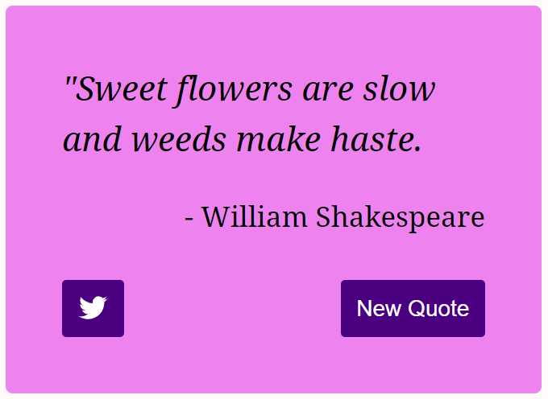

# Random Quote Generator



## Live Demo

[fcc-react-random-quote-generator.netlify.app](https://fcc-react-random-quote-generator.netlify.app/)

## About

This is a react app which generates random quotes and provides a link to post a tweet containing the currently displayed quote.

## Running the App Locally

### Prerequisites

You will need Node.js which can be downloaded [here](https://nodejs.org/).

### Installation

1. Download or clone this repository.

   ```sh
   git clone https://github.com/Jimfarrugia/react-random-quote-generator.git
   ```

2. Navigate to the project's root folder and run the following command to install the required NPM packages.

   ```sh
   npm install
   ```

3. Start the development server by running the following command.

   ```sh
   npm run start
   ```

4. If it does not open automatically, open the application in your web browser at the following address:
   ```
   localhost:3000
   ```
